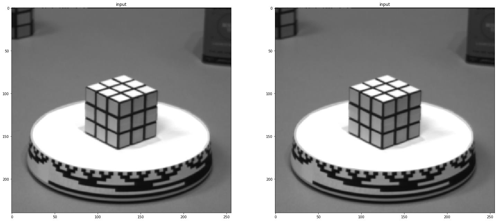

# Computer vision and machine learning notebooks
Some algorithms I have implemented recently. Most of the vision notebooks are based off ideas from the book "Computer Vision - Algorithms and Applications" by Springer. The machine learning models are a bit of everything. Some basic, some more advanced stuff. You need to show a spectrum of knowledge.

**Locally adaptive histogram**

**Qlearning**

I wrote a basic game to test q-learning.

**Anti-aliasing**

**Gan**

based off https://arxiv.org/abs/1610.09585

**Dropout**

based off http://jmlr.org/papers/volume15/srivastava14a/srivastava14a.pdf
model without dropout

model with dropout

**Feature checker**

Based off the idea from https://github.com/evilsocket/ergo (relevance.py).
What feature is contributing what to the models results? If you are going to use this 
in production, set some random data points to zero during trainings as well.

**Filters fixing noise**

**Gradient descent**

Finding a local minima

**A\***

Search algorithm.

**K-means clustering**

**LeCun CNN**

Implemented LeChun CNN model, based off http://yann.lecun.com/exdb/publis/pdf/lecun-01a.pdf

**Markov Random Field**

**Hough Transform**

Basic implementation of hough Transform.

**Auto encoder**

**Gan in numpy**

**Segmentation graph**

**MNIST generalization test**

got the idea from https://arxiv.org/pdf/1611.03530.pdf , how much noise can a simple model handle and still do good evaluation on a noise free dataset? 

the accuracy over time is based on the traing data.

**Generalization**

https://arxiv.org/pdf/1611.03530.pdf

**Poisson image editing**

Mostly a fork off [this](https://github.com/willemmanuel/poisson-image-editing) implementation, I fixed support for python3 and made it work with all the channels. Removed opencv depency as well.

**Feature detection**

Harris corner detector to find special features in each image. Using MSE to connect the special features.

**Counterfactual regret minimization**

Python implementation of the rock, paper, scissor section of http://modelai.gettysburg.edu/2013/cfr/cfr.pdf 

**Lucas–Kanade method, optical flow**

**Segnet**

Had memoryerrors so this model was trained on only a subset of the training set (please hire me so I can build a computer for machine learning). I used the CamVid dataset.

**Transfer learning**

https://en.wikipedia.org/wiki/Transfer_learning

**Autoencoder fixing image noise**

**Numpy rnn**

Loosely based on [iamtrask](https://iamtrask.github.io/2015/11/15/anyone-can-code-lstm/) post. Maybe I wouldn't have coded this if he had used a linked list.

