# Computer vision and machine learning notebooks
Some algorithms I have implemented recently. Most of the vision notebooks are based off ideas from the book "Computer Vision - Algorithms and Applications" by Springer. The machine learning models are a bit of everything. Some basic, some more advanced stuff. You need to show a spectrum of knowledge.

**Locally adaptive histogram**

**Qlearning**

I wrote a basic game to test q-learning.

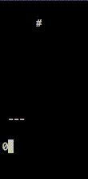

**Anti-aliasing**

**Gan**

based off https://arxiv.org/abs/1610.09585

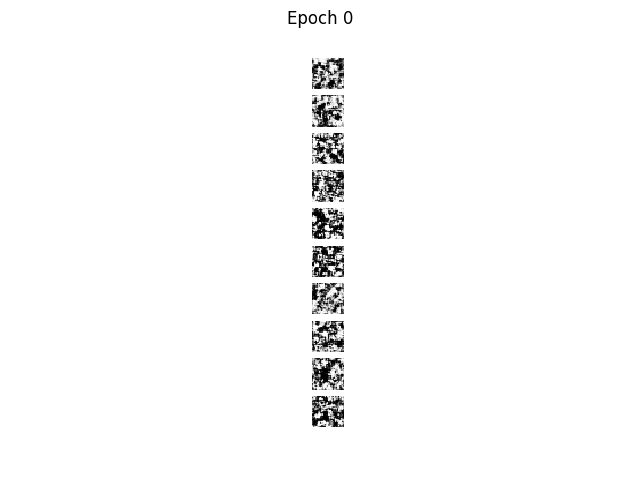

**Dropout**

based off http://jmlr.org/papers/volume15/srivastava14a/srivastava14a.pdf
model without dropout

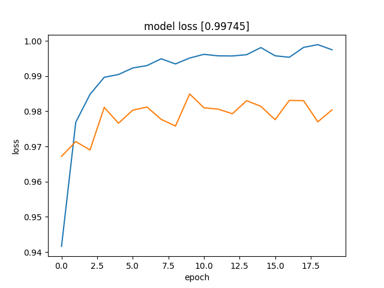

model with dropout

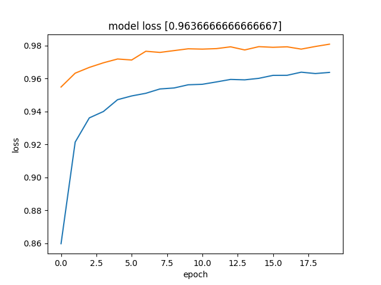

**Feature checker**

Based off the idea from https://github.com/evilsocket/ergo (relevance.py).
What feature is contributing what to the models results? If you are going to use this 
in production, set some random data points to zero during trainings as well.

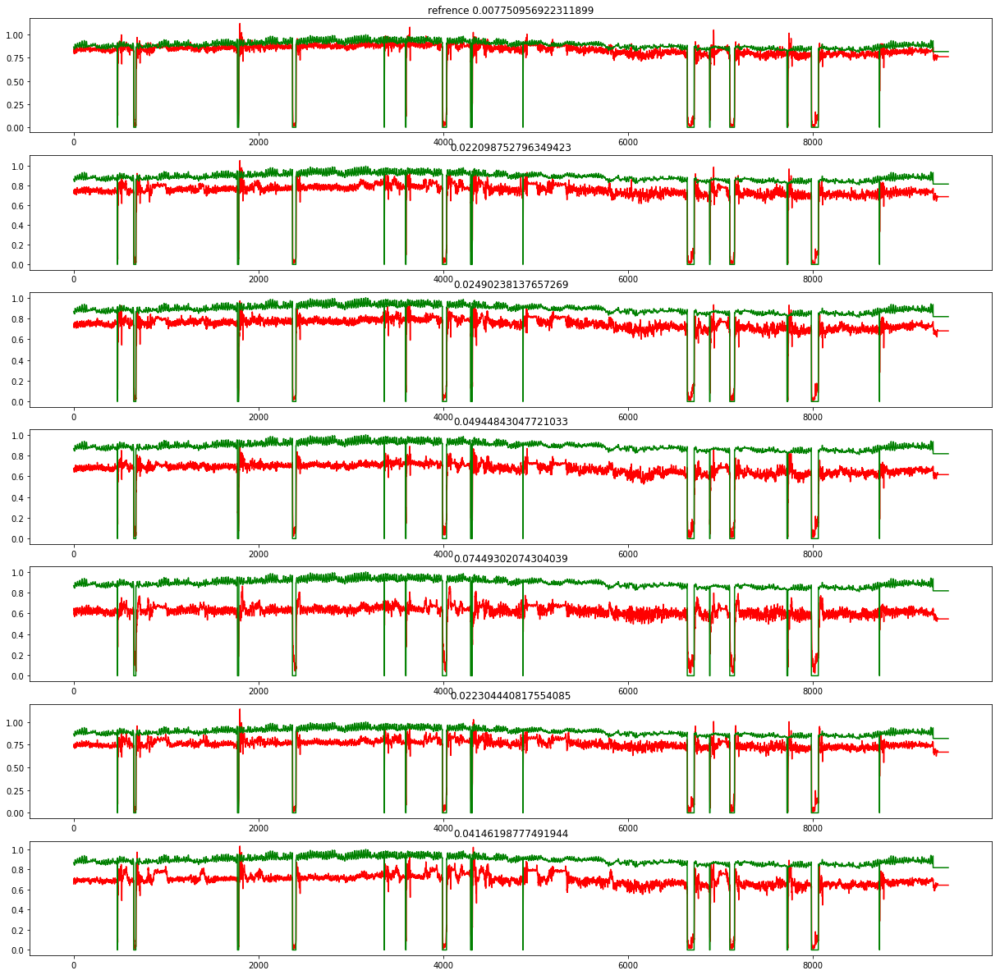

**Filters fixing noise**

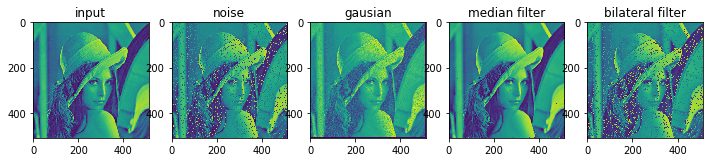

**Gradient descent**

Finding a local minima

**A\***

Search algorithm.

**K-means clustering**

**LeCun CNN**

Implemented LeChun CNN model, based off http://yann.lecun.com/exdb/publis/pdf/lecun-01a.pdf

**Markov Random Field**

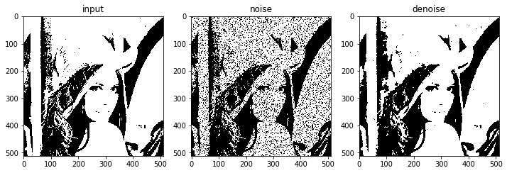

**Hough Transform**

Basic implementation of hough Transform.

**Auto encoder**

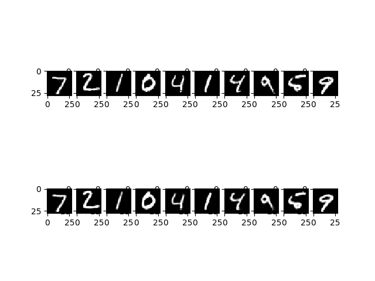

**Gan in numpy**

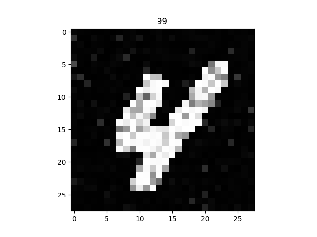

**Segmentation graph**

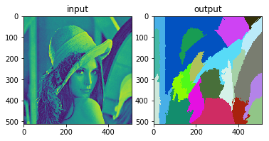

** MNIST generalization test**

got the idea from https://arxiv.org/pdf/1611.03530.pdf , how much noise can a simple model handle of noise and still do good evaluation on a noise free dataset? 

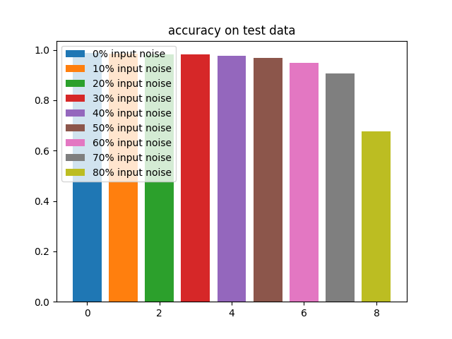

the accuracy over time is based on the traing data.

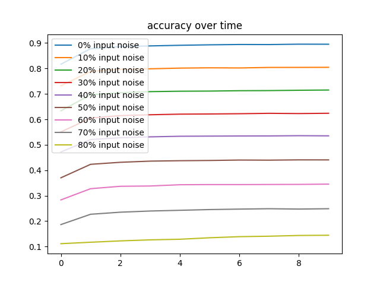

